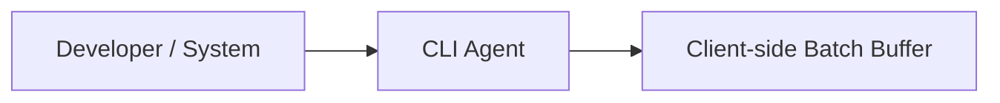
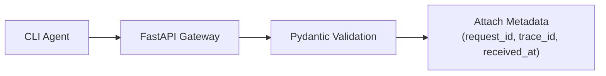
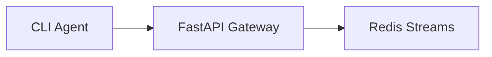
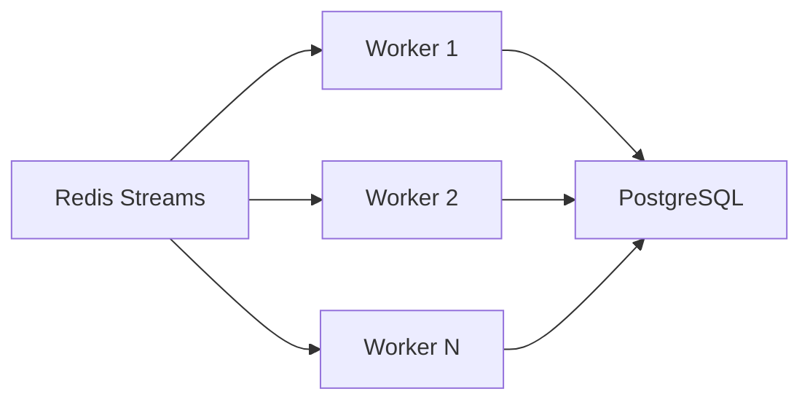
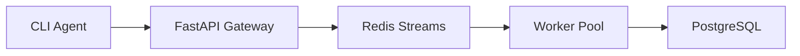
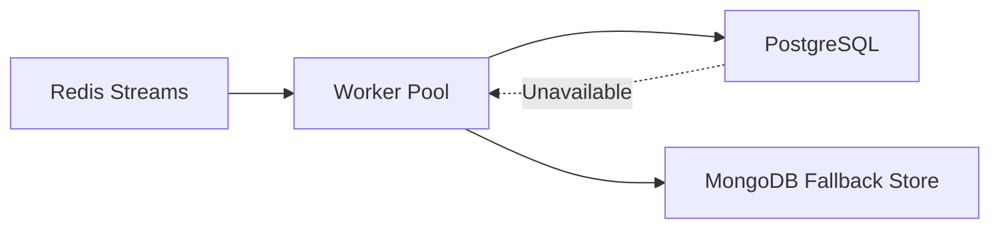
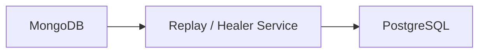
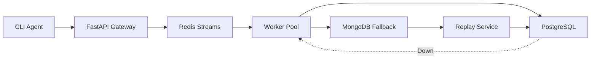

## Phase 1 — Events Generation (Producer)

Generate telemetry and batch events before sending.

---

## Phase 2 — Ingestion Gateway

Gateway only validates - Nothing else

---

## Phase 3 — Decoupling (Gateway and DB) Using Redis Streams

Instead of waiting for PostgreSQL, the Gateway immediately returns **202 Accepted**.

---

## Phase 4 — Worker Pool

Each worker - reads, processes, batch inserts, acknowledges Redis

---

## Phase 5 — Baseline Architecture

---

## Phase 6 — Failure Handling

Workers decide where data goes - Not Gateway

---

## Phase 7 — Recovery

Replay only starts when PostgreSQL becomes healthy.

---

## Phase 8 — Complete Architecture

